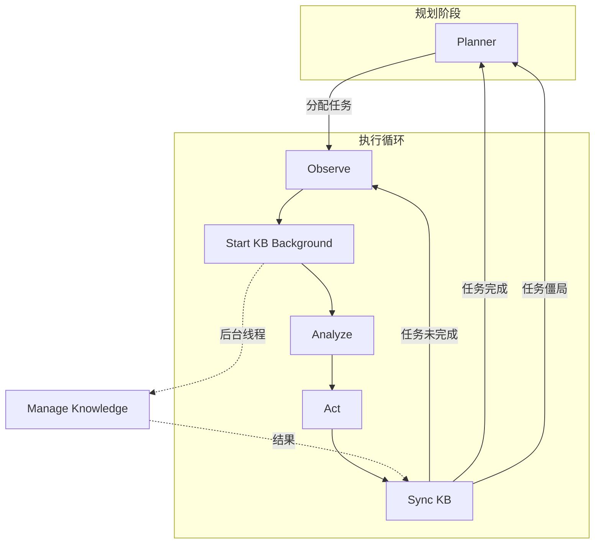

# MUD Autonomous Agent — AImud

> **与 [MUD-ES2](https://github.com/zhtxiii/MUD-ES2) 紧密配合**  
> 本智能体专为 [MUD-ES2](https://github.com/zhtxiii/MUD-ES2) 项目所运行的 MUD 服务端定制开发。
> 智能体可以直接读取 MUD 服务端的 **全部源码**（combatd.c、skilld.c、任务系统等），
> 从而对战斗机制、经验结算、NPC 行为、寻路等做出精确判断，实现有针对性的优化和修改，
> 而非基于猜测或经验推导行事。

基于 LangGraph 开发的自主智能体。本项目采用**规划者驱动 + 阶段化任务**架构，通过高效的并行执行流，实现对远程 Socket 服务的自主探索与交互。

## 0. 核心架构 (Architecture)

### 0.1 职责分离
- **Planner (规划者)**: 独立于执行循环。负责宏观阶段划分、任务生成和具体执行计划的制定。使用强大的推理模型（`deepseek-reasoner`）进行深思熟虑的决策。
- **Executor (执行循环)**: 负责具体的交互、观察和快速反应。使用高效的对话模型（`deepseek-chat`）。
### 2.5 知识管理者 (Knowledge Manager)
- **职责**: 维护长期记忆，支持跨任务信息检索。
- **并行执行**: 独立于主执行循环，在后台线程中处理知识更新。

### 2.6 反思者 (Reflector)
- **职责**: 在任务完成或失败后，分析执行日志，总结经验（Experiences）和提炼技能（Skills）。
- **闭环优化**: 将反思结果注入到分析和规划节点的 Context 中，持续提升智能体表现。
- **持久化**: 经验和技能存储在 `reflections/experiences.json`。

### 0.2 并行执行流
为了提高交互效率，知识管理节点（KB Update）被移至后台线程，与分析（Analyze）和行动（Act）节点并行执行。

```
├── task6/
│   ├── logs/               # 日志目录 (system, planner, knowledge, tasks, reflector)
│   ├── reflections/        # 反思数据 (experiences.json)
│   ├── knowledge_bases/    # 阶段化知识库
│   ├── agent.py            # 主入口
│   ├── reflector.py        # 反思者模块
```



## 1. 核心特性

### 1.1 强大的规划能力
- **推理模型驱动**: Planner 使用 `deepseek-reasoner` 模型，具备更强的逻辑推理和长期规划能力。
- **阶段化任务**: 将探索过程划分为多个阶段（如环境识别、基础交互、深入探索等）。
- **动态调整**: 根据已完成的阶段和累积的知识，动态调整后续任务。

### 1.2 高效的并行架构
- **零阻塞知识库**: 知识库的整理和更新在后台进行，不会延迟对服务器响应的处理。
- **最新信息捕获**: 知识管理员能即时获取服务器的最新输出（`Server Output`），确保知识库的时效性。
- **上下文感知**: 执行循环中的 Analyse 节点拥有全量知识库的上下文，做出最优决策。

### 1.3 健壮的输出处理
- **垃圾过滤**: 自动过滤 Telnet 协商乱码（如 `VF*Z`）和编译器警告。
- **智能重试**: LLM 调用内置重试机制和 JSON 格式校验。

### 1.4 僵局处理 (Stuck Handling)
- **主动僵局识别**: 分析节点（Analyze）会追踪任务尝试次数，一旦超过阈值（默认 50 次）或 LLM 主动判定无进展，即标记任务为 `stuck`。
- **智能决策回退**: 陷入僵局的任务会立即回退给 **Planner**，由其利用更强的推理能力重新决策（跳过、部分完成、简化重试）。

## 2. 流程详解 (Processing Flow)

### 第一步：反思 (Reflection)
**Reflector** 节点在任务完成或失败后被调用。
- 分析上一个任务的执行日志。
- 提取经验教训和可复用的技能。
- *模型*: `deepseek-reasoner`
- 结果存入 `reflections/experiences.json` 并反馈给规划者。

### 第二步：规划 (Planning)
**Planner** 节点被调用。它分析当前的阶段、已完成的任务、全量知识库以及**反思总结的经验与技能**。
- 如果是新阶段，生成该阶段的任务列表。
- 选择下一个待执行任务，制定详细的执行计划（引用可用技能）。
- *模型*: `deepseek-reasoner`

### 第二步：观察与启动 (Observe & Start)
**Observe** 节点接收服务器的原始输出，进行清洗（去除乱码、ANSI 码）。
**Start KB Background** 节点立即启动后台线程运行 `Manage Knowledge`。
- *后台任务*: 知识管理员分析交互历史和最新输出，更新当前阶段的知识库。
- *前台流程*: 立即继续，不等待。

### 第三步：分析与行动 (Analyze & Act)
**Analyze** 节点根据当前任务、执行计划和服务器输出，决定下一步行动。
- *模型*: `deepseek-chat`
- 它可以决定发送命令、继续观察或标记任务完成。

**Act** 节点执行分析结果（发送命令到服务器）。

### 第四步：同步 (Sync)
**Sync KB** 节点等待后台的知识管理任务完成。
- 确保下一轮循环开始前，知识库已完成更新。
- **路由判断**:
    - 如果任务完成 (`task_completed`) -> 返回 **Planner**。
    - 如果任务陷入僵局 (`task_stuck`) -> 返回 **Planner** 进行决策。
    - 否则 -> 返回 **Observe** 继续执行循环。

## 3. 快速开始

### 3.1 环境配置
1. 安装依赖: `pip install langgraph openai`
2. 配置 API Key: 在 `apikey.txt` 中填入 DeepSeek API Key。
3. 配置服务器: 在 `config.py` 或环境变量中设置 `AGENT_TARGET_IP` 和 `PORT`。

### 3.2 运行
```bash
./run_agent.sh
```

### 3.3 监控
- 实时日志: `tail -f logs/system/runtime.log`
- 交互日志: `logs/system/interaction.log`
- 规划者日志: `logs/planner/history.log`
- 反思者日志: `logs/reflector/reflections.log`
- 知识管理日志: `logs/knowledge/manager.log`
- 任务详情日志: `logs/tasks/`
- 知识库文件: `knowledge_bases/`
- 经验库文件: `reflections/experiences.json`
